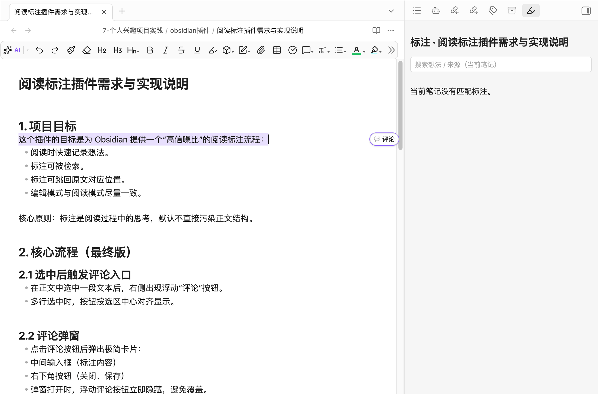
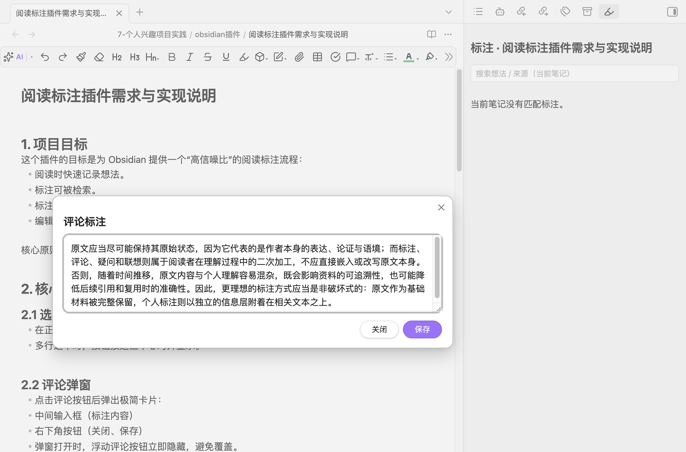
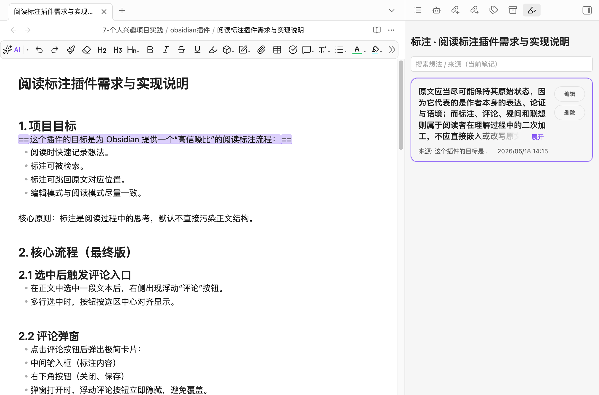
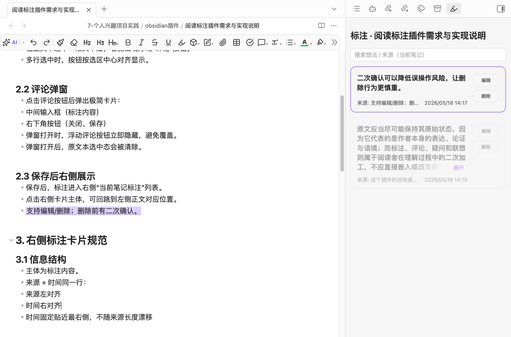

# Reading Annotations

> Obsidian 阅读标注插件：**不污染原文、可追溯、可跳转、可检索**。

## Why
这个插件面向「高信噪比」知识库场景：
- 阅读时快速记录想法，不打断流程
- 标注和来源有清晰关联，后续可查
- 尽量不把临时想法直接混进正文结构
- 编辑模式和阅读模式保持一致体验

## Features
- 选中文本后显示浮动 `评论` 按钮（支持多行选中居中定位）
- 点击按钮弹出评论卡片，记录标注内容
- 右侧「当前笔记标注」列表：
- 点击卡片跳回原文锚点
- 编辑标注、删除标注（删除含二次确认）
- 高亮支持 `Markdown ==高亮==` 写回模式
- 删除标注时可同步移除对应高亮（无其他标注复用时）
- 阅读模式与编辑模式都可完成标注和跳转

## Interaction Flow
1. 在正文中选中一段文本
2. 点击右侧浮动 `评论`
3. 输入想法并保存
4. 在右侧标注列表管理与回跳

## Illustrated Workflow
本文用 4 张图说明插件的核心交互：
选中正文 -> 点击评论 -> 输入并保存 -> 右侧卡片联动显示。

### 图1：选中正文后出现评论按钮


说明：
- 在正文中选中任意文本后，右侧会出现浮动“评论”按钮。
- 多行选中时，按钮按选区中线定位，尽量减少遮挡。
- 点击该按钮进入评论弹窗。

### 图2：弹出评论标注卡片并保存


说明：
- 弹窗为极简结构：中间输入区 + 右下角“关闭/保存”。
- 输入标注内容后点击“保存”，即创建标注。

### 图3：保存后右侧出现标注卡片，左侧原文高亮


说明：
- 右侧显示当前笔记标注列表。
- 左侧选中正文同步高亮。
- 高亮颜色跟随 Obsidian 主题色（主题切换时自动适配）。
- 点击右侧卡片主体可跳回正文对应位置。

### 图4：右侧卡片显隐规则（滚动联动）


说明：
- 默认非当前锚点卡片为弱显（降低透明度）。
- 当正文滚动到对应选区附近时，该卡片变为高亮态（100%）。
- 滚离后恢复弱显，以减少干扰，突出当前阅读上下文。

### 备注
- 删除右侧标注后，左侧对应高亮会同步取消。
- 编辑模式与阅读模式均支持这套流程。

## Architecture
- `Sidecar`：标注事实源，不依赖把标注数据写进 Markdown 元数据
- `SQLite`：索引与检索加速层
- `Hybrid Anchor`：行号 + 文本 + 上下文混合定位，提升回跳鲁棒性
- `Theme-aware UI`：高亮与主题色联动

## Project Structure
```text
src/
  core/        # anchor / sidecar / sqlite / service
  ui/          # modal / annotation list view
  main.ts      # plugin entry
tests/         # vitest tests
```

## Development
```bash
npm install
npm run build
npm run dev
```

## Test
```bash
npm test
npx tsc --noEmit
```

## Install (Manual / Dev)
1. 构建得到 `main.js`、`manifest.json`、`styles.css`
2. 拷贝到你的 Vault 插件目录：
   `.obsidian/plugins/reading-annotations/`
3. 在 Obsidian 的社区插件页面启用该插件

## Roadmap
- [ ] 更细粒度的高亮策略（按段、按标签）
- [ ] 可配置的标注列表排序/筛选
- [ ] 可选跨笔记检索视图
- [ ] 更完整的设置面板（样式、快捷键、写回策略）

## Contributing
欢迎 Issue / PR。

建议流程：
1. Fork 并新建分支
2. 提交改动并附测试说明
3. 发起 PR，描述背景、方案和影响范围

## License
MIT
